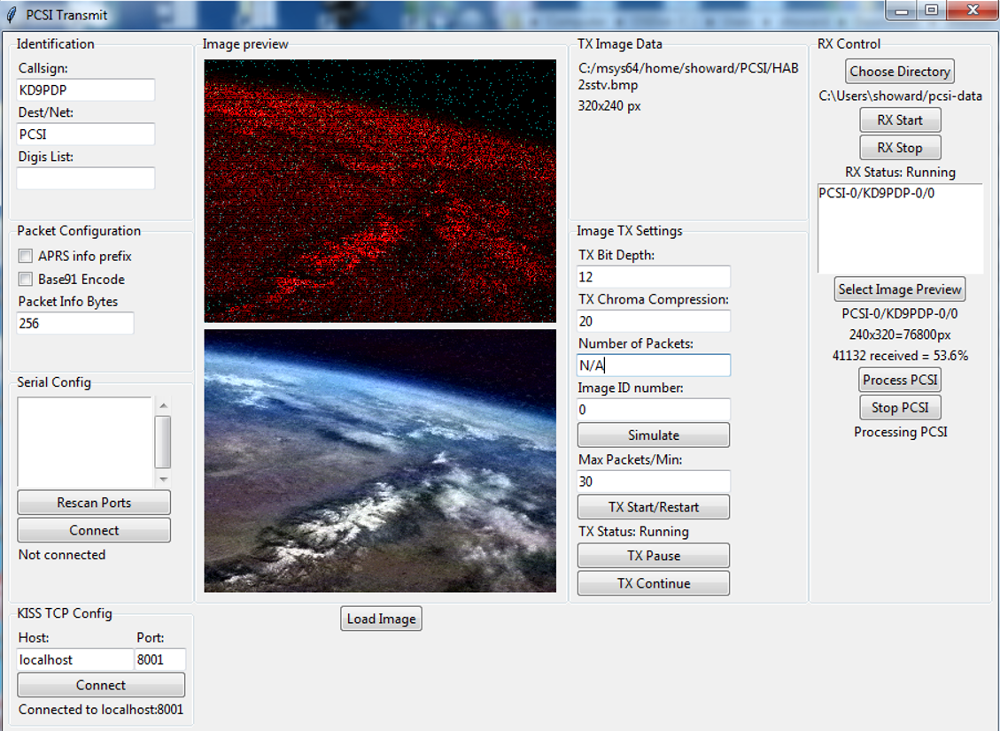

# Packet Compressed Sensing Imaging (PCSI)
This repository holds the specefication and a usable reference implementation of PCSI.
The respository contains code to simulate PCSI transmission and code to transmit & receive PCSI images using a TNC connected via KISS to transmit AX.25 frames.

Author: KD9PDP

License: GPL-3.0

## What is PCSI?
PCSI is a way of transmitting imaging data over unconnected networks where receiving stations may each receive different random packets (due to corruption from noise or blocked signals) yet each receiving station can individually reconstruct the entire original image with high fidelity only with the packets it received. High quality, full frame images, can be reconstructed with as little as 10% of the original data being transmitted or received. Even if a receiver joins the broadcast mid-transmission, it will be able to reconstruct the full image.

## Programs/tools included
**pcsiGUI.py** is a graphical user interface for sending, receiving, and processing PCSI images. See the [documentation here](https://maqifrnswa.github.io/PCSI/) for instructions and videos.

**pcsiSimulator.py** is a command line tool, see "./pcsiSimulator.py --help" for details.

**pcsiSerial.py** is a work in progress. So far it transmits AX.25 PCSI frames.

## How to install
Precompiled GUI packages are available for Windows, MacOS, and Linux at (https://github.com/maqifrnswa/PCSI/releases)

Bleeding edge development snapshots are available! These are built continiously, so new features and bug fixes will show up here first, but there may be new bugs. Please test them out and report issues you find here on github.
* Windows: (https://ci.appveyor.com/api/projects/maqifrnswa/pcsi/artifacts/dist/pcsiGUI-win64.zip?job=win64)
* MacOS: (https://ci.appveyor.com/api/projects/maqifrnswa/pcsi/artifacts/dist/pcsiGUI-macos64.zip?job=macos64)

## Build instructions
You can also build/run it yourself. You need the following:
* Python 3 and the following Python packages
  * OpenCV (opencv-python)
  * NumPy
  * ImageIO
  * BitString
  * PyLBFGS (includes pre-built [liblbfgs](https://github.com/chokkan/liblbfgs))
  * PySerial
  * Pillow
  * PyInstaller (optional, if you want to build executable files)
  
These can all be installed using `python3 -m pip install opencv-python numpy imageio bitstring pylbfgs pyserial pillow`

### Linux and MacOS build instructions
1. You probably already have python installed. If not, install python version 3 from your distribution (e.g., `apt`), (Python.org), or Anaconda.
1. Install Python modules above (either pip, virtual env, or distribution packages e.g., `sudo apt-get install python3-numpy`). All are available on PyPi so they can at least be installed using pip.
1. Download this project, and run the command you'd like, e.g., `python3 pcsiGUI.py`.

### Windows build instructions
1. Download and install Python version 3 from (Python.org).
1. install the needed Python packages. Use a venv if you'd like, or just `pip install opencv-python numpy imageio bitstring pylbfgs pyserial pillow` in a command window.
1. Grab this repository using git (if you have git installed `git clone https://github.com/maqifrnswa/PCSI.git`) or just downloading it from (https://github.com/maqifrnswa/PCSI/archive/master.zip).
1. Enter the directory `cd PCSI` and run the GUI or whatever command you want to use e.g., `python3 pcsiGUI.py`
1. If you want to build your own executable, check out `dist.sh` for hints and `pip install pyinstaller`.
